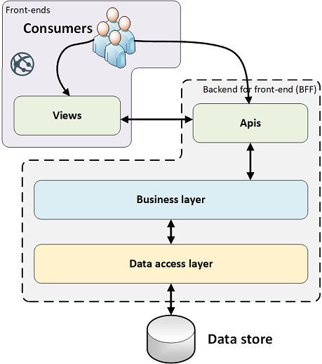
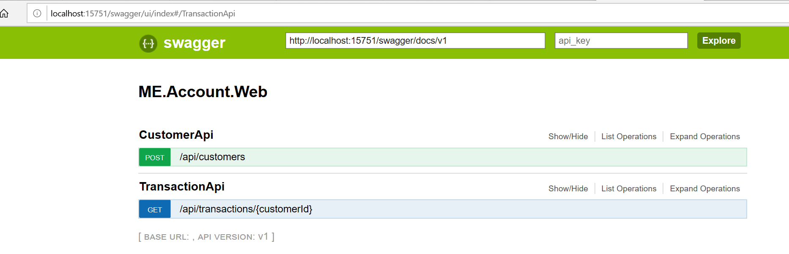

## Introduction

This solution is a variation of the monolith MVC application as shown [here](https://github.com/spice67/carmen/tree/master/ME.Account.Web).

This solution is instead built on AspNet.Core Web API app.
For further reading on the topic, please refer <a href="https://docs.microsoft.com/sv-se/aspnet/core/web-api/?view=aspnetcore-3.1">here</a>.

To enhance layering as the previous solution, the core business and data contracts where patterns such as repository pattern and implementation is put in a virtual catalog within the project named 'core'. This could have been placed in an external lib but for simplicity, it is done within the same project.

For IoC, unity is still used. <a href="https://github.com/unitycontainer/unity" target="_blank">Please refer to this link if interested</a>.

In the previous exercise (see link above), an in-memory data store is used. To maintain the architecture, the data store is changed to a more distributed in-memory data store in the form of redis cache. This is also to show maintainable code and structure with a little effort to change to another data repository.
More on redis cache can be found [here](https://redis.io/).

Furthermore, this solution has a slight separation of concern for the front-end and the back-end.
See the architectural overview below.

When it comes to the cross-cutting or non-functional layer, it is a topic in it's own so is not taken into account within this exercise although the boiler plate on AspNet.core (web api app) could still be seen.

## Pre-requisites
To fully understand the concept of the architectural structure below and the codes itself, at least a knowledge of web api app in aspnet.core is expected.

More on web api aspnet.core <a href="https://docs.microsoft.com/en-us/aspnet/core/web-api/?view=aspnetcore-3.1" target="_blank">here.</a>

For redis installation on your local machine, follow this <a href="https://docs.microsoft.com/en-us/windows/wsl/install-win10#install-the-windows-subsystem-for-linux" target="_blank">guide.</a>

This presumes a dev machine for windows and using wsl (windows subsystem for linux). Redis is already installed in most linux machines but the guide even takes you through installing redis in your linux image on windows. ;)

## Architectural overview



## Getting Started

To test on your local machine:

    * Download/clone this repo.

    * Either start the application/project directly from VS2019.

    * Set up in IIS (or environment of choice as long as OS is Windows).

**Using the api:**

> **For customer account:** 


##### *POST https://[your host]/api/customers*

i.e.

https://localhost:15751/api/customers with ex. payload: 

```json
{ "customerId" : "CUST12345-67", "initialCredit" : 35.56 }
```


This would return a customer account object containing the customer and its account.
ex.

```json
{ "CustomerId": "CUST12345-67", "AccountNo": "ACNT0" }
```


> **For transactions:** 

##### *GET https://[your host]/api/transactions/{customerId}*

i.e. 

https://localhost:15751/api/transactions/CUST12345-67

This would return the transactions done for the said customer with connected account. 
ex. 

```json
{
    "customerInfo": {
        "Customer": {
            "Id": "CUST12345-67",
            "Name": "John",
            "Surname": "Doe"
        },
        "Transactions": [
            {
                "Id": "TRAN_dfef9a60-95dc-4129-944e-0b37be190401",
                "AccountNo": "ACNT0",
                "transDate": "2020-04-08T00:00:00+02:00",
                "Amount": 33.45
            },
            {
                "Id": "TRAN_2221e72e-3e66-4f0c-9759-043fbeec1297",
                "AccountNo": "ACNT0",
                "transDate": "2020-04-08T00:00:00+02:00",
                "Amount": -50.0
            },
            {
                "Id": "TRAN_9389b8f7-5f7a-41ce-a64f-4c8ceeed6e8f",
                "AccountNo": "ACNT0",
                "transDate": "2020-04-08T00:00:00+02:00",
                "Amount": -9.2
            },
            {
                "Id": "TRAN_4a574548-0e12-43a8-b844-981e62ef7910",
                "AccountNo": "ACNT0",
                "transDate": "2020-04-08T00:00:00+02:00",
                "Amount": 100.5
            },
            {
                "Id": "TRAN_57203beb-3431-4a02-a59a-019939144d29",
                "AccountNo": "ACNT0",
                "transDate": "2020-04-08T00:00:00+02:00",
                "Amount": 65.34
            }
        ]
    },
    "balance": 140.09
}
```


Since we are using an in-memory persistent storage the following pre-set up is used in the hash table persistent store:

| Account  | CustomerID   |
|----------|--------------|
| ACNT0    | CUST12345-67 |
| ACNT1    | CUST12346-77 |
| ACNT2    | CUST12355-68 |
| ACNT3    | CUST12365-87 |


The full pre-load of data is now set in *RedisContext.cs*.

In a real-life scenario, this would be the part where we fill-in data with either a migration process from a previous data store (database of choice) or fill-in with pre-req data. Or another probable scenario would be improvement of this impressive :) solution to be able to add customers with their associated accounts... unending possibilities! ;)

## Build and Test

The solution is built on VS 2019 (.netcore 3.01) and can be directly downloaded and cloned on your own local machine.

## UI

As shown on the architectural view above, the UI is now separated from our api. This would mean that
anyone who is entitled (this is another topic for authentication and authorization) to consume the api,
now can build their own UI or perhaps use the api for another type of application.

However, we still can try and test the api thru its swagger/open api doc as described below.

## The API itself

The api itself can still be reach through http(s)://[*yourhost*]/swagger i.e. https://localhost:15751/swagger. However, behind the scenes the library used now no longer swashbuckle but NSwag.

More on NSwag can be found [here](https://docs.microsoft.com/en-us/aspnet/core/tutorials/getting-started-with-nswag?view=aspnetcore-3.1&tabs=visual-studio).

It should look like below:



