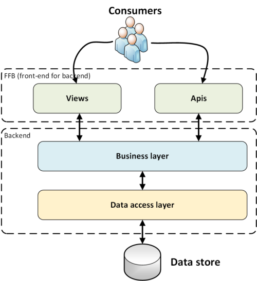
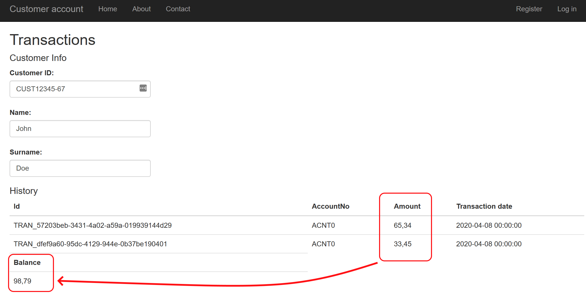

## Introduction

This solution built on the MVC concept and uses the VS template (web-api) for that.

To enhance layering, the core business and data contracts where patterns such as repository pattern and implementation is put in a virtual catalog within the project named 'core'. This could have been placed in an external lib but for simplicity, it is done within the same project.

For IoC, unity is used. <a href="https://github.com/unitycontainer" target="_blank">Please refer to this link if interested</a>.

In this exercise, instead of using a concrete data store (i.e. postreg sql, ms sql or other rdms dbs), this solution uses only an in-memory hash table in .net framework which then implements the repository pattern.

When it comes to the cross-cutting or non-functional layer, it is a topic in it's own so is not taken into account within this exercise although the boiler plate from MVC VS is already there.

## Pre-requisites
To fully understand the concept of the architectural structure below and the codes itself, at least a knowledge of what model-view-controller (MVC) in .net means.

For further reading on the topic, please refer <a href="https://docs.microsoft.com/sv-se/aspnet/core/mvc/overview?view=aspnetcore-3.1">here</a>

## Architectural overview



## Getting Started

To test on your local machine:

    * Either start the application/project directly from VS2019.

    * Set up in IIS (or environment of choice as long as OS is Windows).

**Using the api:**

> **For customer account:** 


##### *POST https://[your host]/api/customers*

i.e.

https://localhost:15751/api/customers with ex. payload: 

```json
{ "customerId" : "CUST12345-67", "initialCredit" : 35.56 }
```


This would return a customer account object containing the customer and its account.
ex.

```json
{ "CustomerId": "CUST12345-67", "AccountNo": "ACNT0" }
```


> **For transactions:** 

##### *GET https://[your host]/api/transactions/{customerId}*

i.e. 

https://localhost:15751/api/transactions/CUST12345-67

This would return the transactions done for the said customer with connected account. 
ex. 

```json
{
    "customerInfo": {
        "Customer": {
            "Id": "CUST12345-67",
            "Name": "John",
            "Surname": "Doe"
        },
        "Transactions": [
            {
                "Id": "TRAN_dfef9a60-95dc-4129-944e-0b37be190401",
                "AccountNo": "ACNT0",
                "transDate": "2020-04-08T00:00:00+02:00",
                "Amount": 33.45
            },
            {
                "Id": "TRAN_2221e72e-3e66-4f0c-9759-043fbeec1297",
                "AccountNo": "ACNT0",
                "transDate": "2020-04-08T00:00:00+02:00",
                "Amount": -50.0
            },
            {
                "Id": "TRAN_9389b8f7-5f7a-41ce-a64f-4c8ceeed6e8f",
                "AccountNo": "ACNT0",
                "transDate": "2020-04-08T00:00:00+02:00",
                "Amount": -9.2
            },
            {
                "Id": "TRAN_4a574548-0e12-43a8-b844-981e62ef7910",
                "AccountNo": "ACNT0",
                "transDate": "2020-04-08T00:00:00+02:00",
                "Amount": 100.5
            },
            {
                "Id": "TRAN_57203beb-3431-4a02-a59a-019939144d29",
                "AccountNo": "ACNT0",
                "transDate": "2020-04-08T00:00:00+02:00",
                "Amount": 65.34
            }
        ]
    },
    "balance": 140.09
}
```


Since we are using an in-memory persistent storage the following pre-set up is used in the hash table persistent store:

| Account  | CustomerID   |
|----------|--------------|
| ACNT0    | CUST12345-67 |
| ACNT1    | CUST12346-77 |
| ACNT2    | CUST12355-68 |
| ACNT3    | CUST12365-87 |


Please refer to *DataRepositoryBase.cs* to see the full set-up.

In a real-life scenario, this would be the part where we fill-in data with either a migration process from a previous data store (database of choice) or fill-in with pre-req data. Or another probable scenario would be improvement of this impressive :) solution to be able to add customers with their associated accounts... unending possibilities! ;)

## Build and Test

The solution is built on VS 2019 (.net framework 4.6) and can be directly downloaded and cloned on your own local machine.

## UI

Our simple user interface (UI) consists of two views --- a customer and 
a transaction view.

### Customer view


> The customer view shows two editable text box to fill-in the customer id and the initial credit that would be added to a transaction for this particular customer as shown above.

> When a customer is found within the table above, the initial edit would then be added to the transaction for the customer as well as within it's account.

> A balance for the transactions is then shown as below. See even the api above.


### Transaction view



## The api itself

The api itself can be reach through http(s)://[*yourhost*]/swagger i.e. https://localhost:15751/swagger.

Behind the scene, in order to view such a nice API doc tool, swashbuckle is used.
More on swashbuckle can be found [here](https://docs.microsoft.com/en-us/aspnet/core/tutorials/getting-started-with-swashbuckle?view=aspnetcore-3.1&tabs=visual-studio).

It should look like below:


